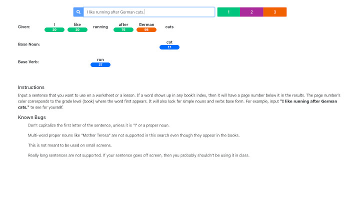

# [Total English Sentences](https://teflassistant.com/tea-sentences/)
Lookup whole sentences at once to help in making worksheets.

## Purpose/Goal
* To make sure that any sentence you want to use in a worksheet or as part of a lesson only uses words that are found in the material.
* This tool allows you to input a full sentence to check if the words are in the book.

## Operation
* Start typing a sentence in the input field.
* As you type, the words will begin to appear below.
* Different verb forms will show their base form.
* Nouns will show their singular form.
* The pages (numbers) and grades (colors) correspond to the first place in the books where the word appears.
* If the word doesn't show up in any book, then it will not have a page and grade associated with it.

## Tech/Libraries Used
* HTML
* CSS
* JavaScript
* React

## Problems/Solutions
* The first letter of the sentence needs to be lowercase unless it is the letter "I". I am working on a solution to this (May 24th, 2020).

## More Information
Ideas for future improvements;
* A fuzzy word search with recommendations in case you make a typo.
* The ability to click on a word in the fuzzy search that replaces it in the input field automatically.
* The ability to save, during your session, the sentences you input and their results.
* Support for multi-word nouns and verb-phrases.
